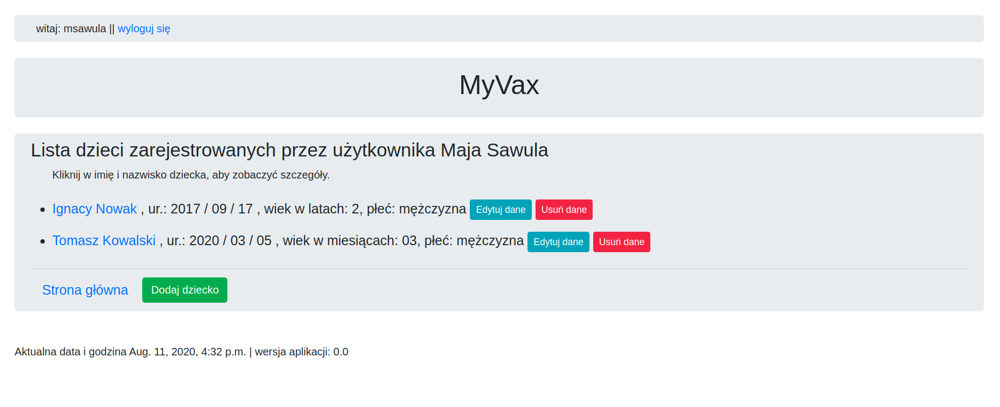

# MyVax
> This app supports parents with the timely performance of periodic examinations and vaccinations children.

## Table of contents
* [General info](#general-info)
* [Screenshots](#screenshots)
* [Technologies](#technologies)
* [Features](#features)
* [Status](#status)
* [Inspiration](#inspiration)
* [Contact](#contact)

## General info

The task of the application will be to send notifications (reminders) about upcoming workups and vaccination dates for childrens.

When the user registers his children in the application. The application prepares a  periodic examinations plan for a child based on the Polish pediatric recomendations. The application will be prepare a vaccination plan for a child based on the Polish vaccination calendar. In this moment this plan can by added only manually by administrator. When the periodic examination or vaccination deadline is approaching, the application will be send a reminder e-mail to the user. This feature will be added in future. After periodic examinations or vaccination, user must complete the dates in the appropriate filds in app.

The application was created on one's own at the end of the course of Python back-end developer.

## Screenshots

## Technologies
* Python 3.6
* Django 3.0.8
* PostgreSQL
* psycopg2-binary 2.8.5
* python-dateutil 2.8.1

## Features

* Adding, editing, deleting child's data
* Automatic creation of a child's periodic examination plan based on the child's date of birth.
* Storing the dates of your child's periodic examination and medical recommendations.
* Manual creation of a vaccination plan for a child by the app's administrator.
* Storing the dates of your child's vaccination and symptoms after vaccination.

#### To-do list:
* Automatic creation of a vaccination plan for a child based on their date of birth and the vaccination calendar for the given year.
* The mechanism of checking the upcoming vaccination dates and periodic tests of children.
* The mechanism of sending messages to parents about the upcoming vaccination dates and periodic tests of children.

## Status
Project is: _in progress_

## Inspiration
I was inspired by my daughter Agata, who was almost an adult but had not completed all vaccinations yet and offered me to write such an app to help other parents remember about it.

## Contact
Created by [marek.sawula@gmail.com](http://ec2-3-124-242-70.eu-central-1.compute.amazonaws.com:8000/myvax) - feel free to contact me!
